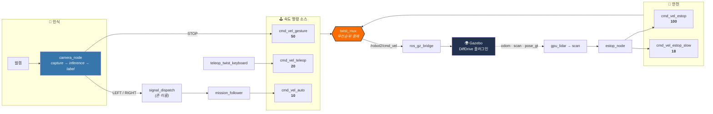

<div align="center">

# 🦾 Signal-Simulation

### 수신호로 움직이는 물류 로봇 — Gazebo 시뮬레이션 & 로봇 제어

**신호수(traffic controller)의 손동작을 카메라로 읽어, 공장 안의 물류 이동 로봇을 정지 · 전진 · 좌/우 파견시킵니다.**<br/>
신호수를 보지 못해 발생하는 사고를 줄이고, 별도 컨트롤러 없이 사람이 로봇에 직접 명령하는 것이 목표입니다.

<br/>


<br/>

[**빠른 시작**](#-빠른-시작) · [**시스템 구조**](#-시스템-구조) · [**패키지**](#-패키지-구성) · [**문서**](#-문서) · [**로드맵**](#-로드맵)

</div>

---

## 📌 이 리포지토리의 범위

이 리포지토리는 프로젝트의 **Gazebo 시뮬레이션 + 로봇 담당**입니다. 인식된 라벨 **이후의 모든 것** <br>
라벨을 속도, 목적지 명령으로 바꾸고, 명령 소스를 중재하고, 로봇을 실제로 구동하는 부분을 소유합니다.

| | 담당 | 위치 |
|:--:|---|---|
| ✅ | 월드 · 로봇 모델(SDF/URDF) · launch 구성 | 이 리포지토리 |
| ✅ | 라벨 → 속도 변환, 명령 중재, 주행 · 안전 노드 | 이 리포지토리 |
| ✅ | ROS 2 ↔ Gazebo 브리지, tf, RViz 시각화 | 이 리포지토리 |
| ↗️ | 카메라 이미지 처리 · 수신호 인식 모델 | **Signal-Vision** (상위 리포지토리) |

> [!NOTE]
> `src/signal_vision/signal_vision/vision_hand/` 는 Signal-Vision 소스의 **벤더 사본**입니다. 시뮬레이션이 추론을 같은 프로세스에서 돌려야 해서 가져온 것으로, 포크가 아닙니다.
> 인식 동작을 바꾸려면 상위에서 고치고 `scripts/setup_infer_env.py` 로 사본을 갱신하세요. 여기서 직접 수정하지 않습니다.

---

## ✨ 주요 기능

<table>
<tr>
<td width="33%" valign="top">

### 🖐️ 수신호 제어
실물 웹캠 → 랜드마크 추출 → 분류 모델.<br/>
`STOP` 은 즉시 속도 명령으로, `LEFT` · `RIGHT` 는 **목적지 존 파견**으로 해석됩니다. 전진·감속 라벨은 아직 학습 전입니다.

</td>
<td width="33%" valign="top">

### 🚚 파견 주행
`mission_follower` 가 수신호석에서 대기하다, 목적지 명령을 받으면 `tracks.yaml` 경로로 원판을 찍고 복귀합니다. 파견은 수신호보다 오래 살아남습니다.

</td>
<td width="33%" valign="top">

### 🛑 다층 안전
라이다 기반 `estop_node` 가 통로 안 장애물을 보고 **정지(1.5 m)** 하거나 **감속(1.5~5 m)** 합니다. 사람 개입은 언제나 최우선.

</td>
</tr>
<tr>
<td valign="top">

### 🏭 실제 공장 월드
`navi_factory` — warehouse 건물, 트랙 타일, 존 원판, 이동하는 작업자 액터로 구성된 자체 월드.

</td>
<td valign="top">

### 📡 센서 & 시각화
전방 180° `gpu_lidar`, RViz2 자동 실행. 스캔이 **어디를 못 봤는지**까지 `scan_rays` 로 그려 줍니다.

</td>
<td valign="top">

### 🔀 우선순위 중재
`twist_mux` 가 6개 속도 소스(현재 5개 활성)를 우선순위로 중재 — 어느 노드도 `cmd_vel` 을 직접 조정하지 않습니다.

</td>
</tr>
</table>

---

## 🧭 시스템 구조



### 명령 경로 한눈에

```
웹캠 → camera_node (수신호 존 게이트로 판정)
  ├─ STOP         → cmd_vel_gesture ────────────────────┐
  └─ LEFT / RIGHT → signal_dispatch                     │
                       └→ mission_follower              │
                              → cmd_vel_auto ───────────┤
teleop(미사용)         → cmd_vel_teleop ─────────────────┤
estop_node            → cmd_vel_estop / _estop_slow ────┤
                                                        └→ twist_mux → /robot2/cmd_vel → bridge → 구동 플러그인
```

**속도 라벨**은 `twist_mux` 를 지나는 속도 명령이고, **파견 라벨**은 목적지 존 이름을 지목합니다.
파견은 그것을 일으킨 수신호보다 오래 살아남습니다 — 회전 신호를 놓는 순간 순찰이 로봇을 도로 틀어버리던 문제를 없앤 지점입니다.

---

## 🚀 빠른 시작

### 요구 사항

| 항목 | 버전 |
|---|---|
| OS | Ubuntu 24.04 (Noble) |
| ROS 2 | Jazzy Jalisco |
| Gazebo | Harmonic (`gz sim`) |
| Python | 3.12 (시스템 python — venv 아님) |
| 하드웨어 | 로봇 1대당 USB 웹캠 1대 |

### 1️⃣ 빌드

```bash
git clone https://github.com/SAX-AI-TeamProject1/Signal-Simulation.git
cd Signal-Simulation

# 인식 모델 소스 벤더링 + 런타임 라이브러리 설치 (최초 1회)
python3 scripts/setup_infer_env.py

colcon build --packages-select robot_control signal_vision auto_drive knavi_bringup
source install/setup.bash
```

> [!IMPORTANT]
> venv 로는 `ros2 run` 을 지원할 수 없습니다. colcon 이 console script 의 shebang 을 `/usr/bin/python3` 로 쓰기 때문에, 노드가 import 하는 라이브러리(`torch`, `mediapipe`, `ultralytics`)는 **시스템 python3.12** 에 있어야 합니다.

### 2️⃣ 실행

```bash
ros2 launch knavi_bringup bringup.launch.py
```

월드가 뜨고 로봇(`robot2`)이 스폰되며, RViz2 가 함께 열리고, 웹캠이 수신호를 읽기 시작합니다.

```bash
# GUI 없이, 카메라 없이
ros2 launch knavi_bringup bringup.launch.py headless:=true enable_camera:=false

# 웹캠 장치 번호 지정 (ls /dev/video* 로 확인)
ros2 launch knavi_bringup bringup.launch.py camera_device_id:=1

# 수동 주행으로 깔끔하게 확인
ros2 launch knavi_bringup bringup.launch.py enable_patrol:=false
```

### 3️⃣ 키보드로 몰아 보기

`twist_mux` 가 출력을 소유하므로 `cmd_vel` 에 직접 쓰지 말고 teleop 입력으로 넣습니다.

```bash
ros2 run teleop_twist_keyboard teleop_twist_keyboard \
  --ros-args -r /cmd_vel:=/robot2/cmd_vel_teleop
```

> [!WARNING]
> **GUI 프로그램(`gz sim` 렌더링, RViz)은 반드시 사용자 데스크톱 터미널에서 직접 실행하세요.** SSH·에이전트 셸에서는 GL 컨텍스트가 없어 실패합니다.

<details>
<summary><b>🔧 launch 인자 전체</b></summary>

<br/>

| 인자 | 기본값 | 설명 |
|---|:---:|---|
| `world` | `navi_factory.sdf` | 월드 SDF 경로 (워크스페이스 루트 기준 자동 계산) |
| `use_sim_time` | `true` | 시뮬레이션 시간 사용 |
| `headless` | `false` | `true` 면 `gz` 를 서버만(`-s`) 실행. `enable_rviz` 를 이깁니다 |
| `enable_camera` | `true` | 실물 웹캠 노드(`camera_node`) 동반 실행 |
| `camera_device_id` | *(빈 값)* | 첫 로봇의 `/dev/video<N>` 번호 덮어쓰기 |
| `enable_patrol` | `true` | 수신호 파견 주행 노드(`mission_follower`) 실행 |
| `enable_estop` | `true` | 비상정지 노드(`estop_node`) 실행 |
| `enable_flat_ground` | `true` | ⚠️ **끄지 마세요** — 아래 주의 참고 |
| `enable_rviz` | `true` | RViz2 실행 (`src/robot_control/config/knavi.rviz`) |
| `enable_marker_vision` | `false` | 코너 표지 감속 노드 — 가중치 학습 전엔 꺼 둘 것 |
| `marker_weights` | *(빈 값)* | TrackMarker YOLO 가중치(`.pt`) 절대경로 |

</details>

<details>
<summary><b>⚠️ enable_flat_ground 를 반드시 켜 두어야 하는 이유</b></summary>

<br/>

현재 월드의 `warehouse` 모델에는 **collision 이 하나도 없습니다** — visual 뿐입니다. 따라서 `src/robot_control/config/flat_ground.sdf`(z = 0.25 에 스폰되는 200 × 200 m 콜리전 전용 판)는 우회책이 아니라 **유일한 바닥**입니다.

`enable_flat_ground:=false` 로 두면 로봇이 바닥을 뚫고 무한 낙하합니다 (실측: 몇 초 만에 z < −3000).

벽에도 물리가 없습니다. `gpu_lidar` 는 collision 이 아니라 visual 을 렌더하므로 라이다에는 벽이 잡히지만, 로봇이 벽을 뚫고 지나가는 것을 물리적으로 막는 것은 없습니다.

</details>

---

## 📦 패키지 구성

`ament_python` 패키지 4개. 파일 종류가 아니라 **책임 단위**로 나뉘어 있습니다.

| 패키지 | 소유 | 실행 노드 |
|---|---|---|
| 🦿 **`robot_control`** | `src/robot_control/urdf/`, `src/robot_control/config/` (bridge · twist_mux · rviz · flat_ground) | *없음 — 몸과 배선만* |
| 🖐️ **`signal_vision`** | `camera_node/`, 벤더 `vision_hand/`, 모델 가중치 | `camera_node` |
| 🚚 **`auto_drive`** | `patrol/`, `safety/`, `viz/`, `localization/` | `mission_follower` · `estop_node` · `scan_rays` · `world_markers` · `actor_markers` · `ground_truth_tf`<br/>*(비활성: `marker_vision` · `waypoint_follower`)* |
| 🔧 **`knavi_bringup`** | `launch/bringup.launch.py` | *없음 — 조립 전용* |

```
Signal-Simulation/
├── doc/               # 팀 공용 프롬프트 (AGENT.md · design.md · ml-flow.md · work.md)
├── docs/              # 장문 작업 가이드 (이중언어)
├── examples/          # ROS 2 연습용 별도 워크스페이스
├── scripts/           # 빌드/실행 진입점 + 외부 리포지토리 벤더링
├── src/               # ROS 2 패키지 4개
│   └── robot_control/config/   # bridge.yaml · twist_mux.yaml · knavi.rviz · flat_ground.sdf
├── tools/             # 오프라인 트랙 편집 · SDF 생성
└── worlds/navi_factory/            # 월드 (ROS 2 패키지가 아님 — GZ_SIM_RESOURCE_PATH 로 찾음)
    └── world/navi_factory/
        ├── navi_factory.sdf        # 월드 본체
        └── tracks.yaml             # 파견 경로 · 존 좌표의 단일 출처
```

> [!NOTE]
> `tracks.yaml` 이 월드 SDF **옆에** 있는 이유: 좌표가 `navi_factory.sdf` 의 `track_*` 타일 pose 실측값이고, `tools/tracks_to_{markers,actors}.py` 가 이 파일에서 다시 그 SDF 로 마커·actor 를 생성해 넣습니다. 월드에 종속된 배치 기술서지 특정 패키지의 파라미터가 아닙니다 — `auto_drive` · `signal_vision` 양쪽이 launch 파라미터로 경로를 받아 읽습니다.

> [!TIP]
> 파일을 **가진** 패키지와 그 파일을 **읽는** 패키지가 다릅니다.<br>
> `knavi_bringup` 은 launch 만 갖고 urdf·config 는 없으며, `robot_control` 은 urdf·config 를 갖지만 아무것도 실행하지 않습니다. 변경 하나에 패키지 두 개를 고치게 되는 걸 예상하세요.

---

## 🔀 명령 중재 (`twist_mux`)

우선순위가 높은 순 (`src/robot_control/config/twist_mux.yaml`). 지정한 timeout 동안 메시지가 없으면 그 소스를 버립니다.

| 입력 토픽 | 우선순위 | timeout | 발행자 |
|---|:---:|:---:|---|
| `cmd_vel_estop` | 🔴 **100** | 0.3 s | `estop_node` — 1.5 m 이내 장애물 정지 |
| `cmd_vel_gesture` | 🟠 **50** | 0.5 s | `camera_node` — 인식된 수신호 |
| `cmd_vel_teleop` | 🟡 **20** | 0.5 s | `teleop_twist_keyboard` — 사람 개입 |
| `cmd_vel_estop_slow` | 🟢 **18** | 0.5 s | `estop_node` — 1.5~5 m 감속 링 |
| `cmd_vel_marker_slow` | 🔵 **15** | 0.5 s | `marker_vision` — 코너 표지 감속 · **현재 미사용** |
| `cmd_vel_auto` | ⚪ **10** | 0.5 s | `mission_follower` — 파견 주행 중에만 |

**설계 의도:** 사람 개입(`teleop` · `gesture`)은 로봇이 스스로 만든 명령(`auto` · `marker_slow`)을 항상 이깁니다. 반대로 안전 정지는 그 모두를 이깁니다.

> [!NOTE]
> `cmd_vel_marker_slow` 자리는 예약만 되어 있고 **지금은 아무도 발행하지 않습니다.** `marker_vision` 노드와 `twist_mux` 배선은 이미 있지만, TrackMarker YOLO 가중치가 아직 학습 전이라 `enable_marker_vision` 기본값이 `false` 입니다 — 켜면 노드 생성자가 바로 에러를 냅니다.

<details>
<summary><b>📡 브리지 토픽 (src/robot_control/config/bridge.yaml)</b></summary>

<br/>

| 토픽 | 방향 | ROS 타입 |
|---|:---:|---|
| `/clock` | gz → ROS | `rosgraph_msgs/Clock` |
| `<ns>/cmd_vel` | **ROS → gz** | `geometry_msgs/Twist` |
| `<ns>/odom` | gz → ROS | `nav_msgs/Odometry` |
| `<ns>/joint_states` | gz → ROS | `sensor_msgs/JointState` |
| `<ns>/scan` | gz → ROS | `sensor_msgs/LaserScan` |
| `/tf` | gz → ROS | `tf2_msgs/TFMessage` |
| `/robot2/pose_gt` | gz → ROS | `geometry_msgs/Pose` |

ROS 에서 Gazebo 로 가는 것은 `cmd_vel` 하나뿐이고, 나머지는 전부 시뮬레이터가 내보내는 방향입니다.

로봇은 토픽이 아니라 **프레임 이름**으로 갈립니다 (`robot2/odom`, `robot2/base_link`, …). `tf2_ros` 가 토픽 이름을 절대 경로로 박아 놓아서 네임스페이스가 tf 에는 적용되지 않기 때문입니다.

</details>

---

## 🏭 월드: `navi_factory`

`worlds/navi_factory/` — warehouse 건물 모델에 프로젝트 소품(트랙 타일, 존 원판, 작업자 액터)을 얹어 구성했습니다. ROS 2 패키지가 **아니며**, launch 가 설정하는 `GZ_SIM_RESOURCE_PATH` 로 Gazebo 가 찾습니다.

**파견 레이아웃** (`worlds/navi_factory/world/navi_factory/tracks.yaml`, 좌표 단위 m):

```
              신호수 (0, 40)
                   ▲
        수신호석 (0, 36.05) ── V자로 상단 트랙(y=40) 갈라짐
                   │
     ┌─────────────┴─────────────┐
  코너 tl                      코너 tr
     │                            │
 zone_nw (-18, 13) ●        ● zone_ne (13, 13)
     │                            │
 계속 남진 → 좌하단 → 하단(y=-18)  y=13 통로
     └────────► 척추 (x = 0) ◄─────┘
                   │
              수신호석 복귀
```

두 경로 모두 척추(x = 0)를 공유하는 **한길**로 복귀합니다. 로봇이 한 대면 비용이 없지만, 두 대가 되면 병목이자 정면 대치 위험입니다 — 중앙 교통 관리 노드가 논의된 방향이며 두 번째 로봇이 실제로 스폰될 때까지 보류 중입니다.

<details>
<summary><b>💡 시작할 때 뜨는 <code>Invalid mesh filename extension[.../__default__]</code> 에러는 무해합니다</b></summary>

<br/>

월드의 `<actor>` 8개 중 7개에 `<skin>` 이 없고, `__default__` 가 그 filename 의 SDF 기본값입니다. gz 가 그걸 월드 폴더 기준으로 풀어 로드에 실패하면서 액터 7개 × 에러 7줄이 **한 번만** 찍힙니다.

skin 로딩만 실패하고 gz 는 액터의 `<link><visual>` 메시로 넘어가 정상 렌더합니다 — 격리 테스트에서 skin 없는 액터도 라이다에 실제 거리로 잡혔습니다.

없애려면 액터에 skin 을 주거나(사람이 두 겹으로 그려질 수 있음) model 로 바꿔야 하는데(이동 경로를 잃음) 둘 다 손해가 더 큽니다. **일부러 그대로 둔 것입니다.**

</details>

---

## 📚 문서

| 문서 | 내용 |
|---|---|
| [doc/design.md](doc/design.md) | 프로젝트 개요 · 현재 상태 · 미해결 항목 |
| [doc/AGENT.md](doc/AGENT.md) | 코드 구조 · 노드/토픽 그래프 · 빌드/실행 · 컨벤션 |
| [doc/ml-flow.md](doc/ml-flow.md) | 머신러닝 학습 프로세스 *(작성 예정)* |
| [docs/camera_node_refactory.md](docs/camera_node_refactory.md) | `camera_node` 책임 분리 & 핸드오프 노트 |
| [docs/gazebo-control-guide.md](docs/gazebo-control-guide.md) | 트랙 위 운반 장비 이동 가이드 |

**테스트** — 스타일 검사(`ament_copyright` · `ament_flake8` · `ament_pep257`)만 있습니다.

```bash
colcon test --packages-select robot_control signal_vision auto_drive knavi_bringup
```

**컨벤션** — 클래스는 `PascalCase`, 함수는 `snake_case`. `src/` 안의 주석과 독스트링은 **한국어**로 쓰고, 무엇을 하는지가 아니라 **왜 그렇게 했는지**를 설명합니다.

---

## 🗺️ 로드맵

### ✅ Phase 1 — 수신호 기반 수동 제어 *(구동 중)*

월드가 뜨고 로봇이 스폰되며, 키보드로도 인식된 수신호로도 파견 주행으로도 로봇이 움직입니다. 리눅스 VM에서 빌드·실행까지 확인된 상태입니다.

### ✅ Phase 2 — 트랙 추종 + 충돌 정지 *(구동 중)*

`mission_follower` 가 `tracks.yaml` 로 정해진 트랙을 따라 주행하고, `estop_node` 가 **갈 길 위에 사람이나 장애물이 들어오면 스스로 세웁니다.** 경로를 새로 짜지는 않습니다 — 정해진 길 위에서 "가다 / 서다" 를 판단하는 단계입니다.

판정 영역은 부채꼴이 아니라 차폭만큼의 직사각형 통로라, 길 옆 선반이나 통로 밖을 지나가는 사람에는 서지 않습니다. 정지 링(1.5 m) 하나만 두면 신호수에게 다가가는 것 자체가 불가능해서, 그 앞에 제동 곡선 감속 링(1.5~5 m)을 한 겹 더 두었습니다.

### 🚧 Phase 3 — 자율 주행 *(진행 예정)*

정해진 트랙을 벗어나 **스스로 경로를 만드는** 단계. 막힌 길을 우회하고 목적지까지 경로를 재탐색합니다. Nav2 · SLAM · costmap 이 여기서 들어옵니다.

Phase 2·3 모두 수신호 기반 수동 제어를 **대체하는 게 아니라 그 위에 얹는** 기능이며, `cmd_vel_auto` 가 그 자리로 예약되어 최저 우선순위를 갖습니다 — **사람의 수신호가 언제나 자율주행을 이깁니다.**

### 📋 알려진 미해결 항목

- **로봇 차체는 대역이고, 질량이 가장 틀린 값** — `mecanum_lift_robot.urdf.xacro` 는 빌려온 메시(`Forklift/base_visual.glb`)에 맞춰 치수를 적어 넣은 것이라 스펙에서 온 값이 아닙니다. `base_mass` 25 kg 은 실제 지게차보다 두 자릿수 작고, 관성·제동거리·접지력이 전부 여기서 따라 나옵니다. 그 위에서 고른 안전 여유(`max_linear_acceleration` 1.5, `slow_decel` 1.2)도 25 kg 전제라, 실차 스펙이 나오면 치수만이 아니라 그 값들도 다시 계산해야 합니다.
- **카메라-로봇 짝이 `/dev/video<N>`** — 커널이 재부팅·재연결 때 번호를 다시 매기므로 카메라가 두 대면 짝이 조용히 뒤바뀔 수 있습니다. `/dev/v4l/by-id/` 경로로 고치면 되지만 `camera_node` 가 정수를 받으므로 파라미터 변경이 필요합니다.

전체 목록과 각 항목의 배경은 [doc/design.md](doc/design.md#open-items) 에 있습니다.

---

## 📄 라이선스

[MIT License](LICENSE) © 2026 SAX-AI-TeamProject1

<div align="center">
<br/>
<sub>Made for safer factories 🏭 · <a href="https://github.com/SAX-AI-TeamProject1/Signal-Simulation">SAX-AI-TeamProject1</a></sub>
</div>
